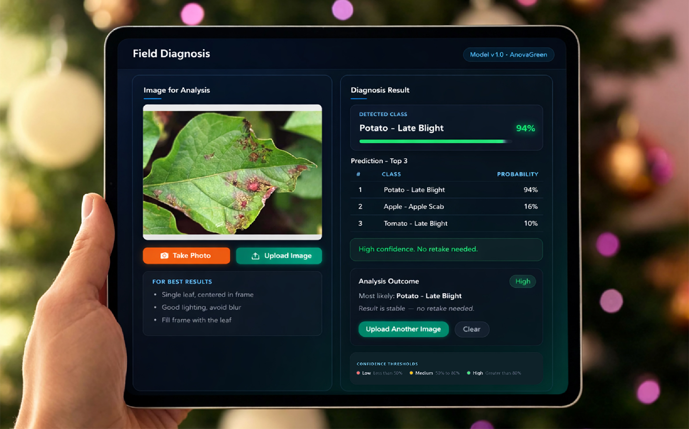

# Plant Disease Detection

A systematic study of **cross-domain plant disease classification** using CNNs and Vision Transformers. Models are trained on PlantVillage (lab conditions) and evaluated on PlantDoc (field conditions) to measure robustness under domain shift.

**26 shared disease classes** | **6 model architectures** | **11 augmentation strategies** | **2 alternative training paradigms**

<p align="center">
  
  <br />
  <em>Inference UI mock (Simulator MVP)</em>
</p>

## Key Results

All models achieve near-perfect accuracy on PlantVillage (~99%). The meaningful benchmark is **PlantDoc** (real-world field images), where domain shift causes significant performance drops. Best results on PlantDoc, ranked by Macro F1:

**TL;DR**
- PlantVillage is near-saturated (~99% acc) across models.
- PlantDoc is the meaningful benchmark; best Macro F1 is **0.45** (Swin-B + Perspective, zero-shot).

| Experiment | Best Model | PlantDoc Acc | PlantDoc Macro F1 |
|---|---|---:|---:|
| Perspective (zero-shot) | Swin-B | 0.48 | 0.45 |
| Random Erasing | ViT-B/16 (AdamW) | 0.41 | 0.37 |
| Supervised Contrastive | ViT-B/16 | 0.38 | 0.35 |
| Rotation Only | CCT-14 | 0.39 | 0.34 |
| Rotation + Gaussian Blur | CCT-14 | 0.37 | 0.33 |
| Gaussian Blur Only | Swin-B | 0.36 | 0.33 |
| Affine | Swin-B | 0.37 | 0.32 |
| CutMix | Swin-B | 0.37 | 0.32 |
| Perspective (finetuned) | CCT-14 | 0.37 | 0.32 |
| CutMixUp | Swin-B | 0.34 | 0.32 |
| Baseline (no augmentation) | MaxViT-B | 0.33 | 0.29 |
| MixUp | Swin-B | 0.33 | 0.28 |

- Decision metric: Macro F1 on PlantDoc.

Full results:
- Report: [`results_zip/report.md`](results_zip/report.md)
- CSV: [`results_zip/master_results.csv`](results_zip/master_results.csv)

## Repository Structure

```
plant-disease-detection/
├── configs/                  # Training configs (JSON) by experiment
│   ├── baselines/            #   No augmentation
│   ├── aug_erasing/          #   Random erasing
│   ├── aug_cutmix/           #   CutMix
│   ├── aug_mixup/            #   MixUp
│   └── ...                   #   (+ cutmixup, rotate, gaussian blur, etc.)
├── backend/                  # FastAPI inference service (Simulator)
├── frontend/                 # React + Vite tablet-style UI (Simulator)
├── src/
│   ├── train/train.py        # Unified training script
│   ├── eval/evaluate.py      # Evaluation on PV + PlantDoc test sets
│   ├── utils/                # Dataloaders, transforms, plotting, model factory
│   └── cct/                  # CCT model implementation
├── scripts/                  # Data preparation pipeline (M1)
├── data/                     # Splits and label maps (gitignored; generated by scripts/)
├── results_zip/              # Archived experiment results and reports
├── docs/                     # Detailed milestone documentation
└── requirements.txt
```

## Quick Start

### 1. Install dependencies

```bash
pip install -r requirements.txt
```

For CUDA-enabled PyTorch:
```bash
pip install -r requirements-pytorch.txt
```

### 2. Prepare data

Place datasets under `data/raw/` ([details](docs/milestones.md#21-dataset-placement)), then run the data pipeline:

```bash
python scripts/make_index.py
python scripts/apply_label_map.py
python scripts/build_mapped_splits.py
```

### 3. Train a model

```bash
python src/train/train.py --config configs/baselines/baseline_vit_base_patch16_224.json
```

### 4. Evaluate

```bash
python src/eval/evaluate.py \
  --model-path checkpoints/baseline/baseline_vit_base_patch16_224.pt \
  --model-name vit_base_patch16_224 \
  --output-file outputs/baseline_vit_base_patch16_224.csv
```

## Models

| Architecture | Type | Source |
|---|---|---|
| MobileNetV3-Small | CNN | torchvision |
| EfficientNet-B0 | CNN | timm |
| ViT-B/16 | Transformer | timm |
| Swin-B | Transformer | timm |
| MaxViT-B | Transformer | timm |
| CCT-14/7x2 | Transformer | custom (`src/cct/`) |

All models use ImageNet pre-trained weights and fine-tune their classification heads (26 classes).

| Model | Freezing Strategy |
|---|---|
| MobileNetV3 Small | Fully trainable (no frozen layers) |
| EfficientNet-B0 | Fully trainable (no frozen layers) |
| ViT Base Patch16 | Backbone frozen, last 4 encoder blocks unfrozen (+ head) |
| CCT 14-7x2 | Everything frozen except classifier FC + last 2 blocks (blocks 12 & 13) |
| Swin Base | Everything frozen, last 2 stages + norm layer unfrozen (+ head) |
| MaxViT Base | Everything frozen, last 1 stage unfrozen (+ head) |

## Experiments

Training is config-driven. Each JSON config specifies the model, hyperparameters, and augmentation transforms:

```json
{
    "model_name": "vit_base_patch16_224",
    "checkpoint_dir": "checkpoints/baseline",
    "hyperparameters": {
        "batch_size": 32,
        "num_epochs": 10,
        "learning_rate": 0.0001,
        "weight_decay": 0.05
    },
    "transformations": [
        { "name": "random_erasing", "params": { "p": 0.5 } }
    ]
}
```

**Augmentation strategies tested:** baseline (none), random erasing, rotation, gaussian blur, rotation + gaussian blur, CutMix, MixUp, CutMixUp, affine, perspective (zero-shot), perspective (finetuned).

**Alternative paradigms:** Supervised Contrastive Learning (SupCon), Multi-Task ViT.

## Domain Gap

The core finding: models trained on PlantVillage generalize poorly to PlantDoc due to the domain shift between lab-controlled and field-captured images.

- **PlantVillage:** clean backgrounds, centered leaves, uniform lighting
- **PlantDoc:** cluttered backgrounds, variable angles, natural lighting

Perspective augmentation with a frozen backbone (zero-shot) yields the best cross-domain transfer (Macro F1 0.45), followed by random erasing + AdamW (Macro F1 0.37). The gap remains large, motivating further work on domain adaptation and reliability layers.

## Simulator (MVP Demo)

AnovaGreen Field Diagnosis — a local web app for interactive plant disease diagnosis. Upload a leaf image and get top-3 predictions from a trained model.

- **Backend:** FastAPI inference service (`backend/`)
- **Frontend:** React + Vite tablet-style UI (`frontend/`)
- **Setup guide:** [`README_SIMULATOR.md`](README_SIMULATOR.md)

## Documentation

- [Milestone details](docs/milestones.md) — step-by-step instructions for data prep (M1), CNN baselines (M2), ViT training (M3), and augmentation experiments (M4)
- [Experiment report](results_zip/report.md) — full comparison across all experiments
- [Master results CSV](results_zip/master_results.csv) — raw metrics for all runs

## License

MIT License (code). Datasets are subject to their respective licenses and terms.
